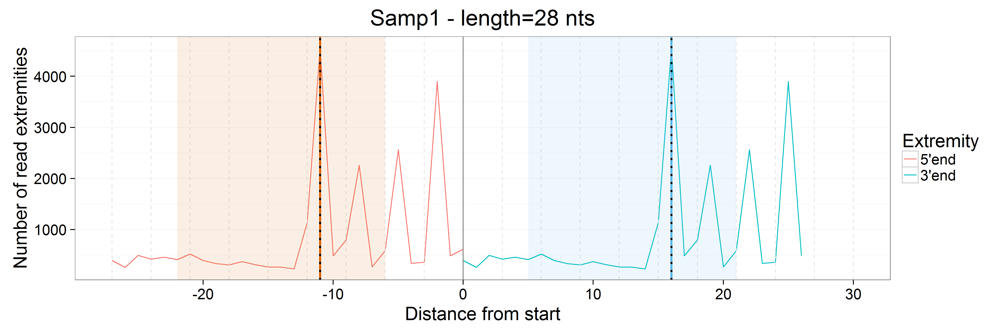
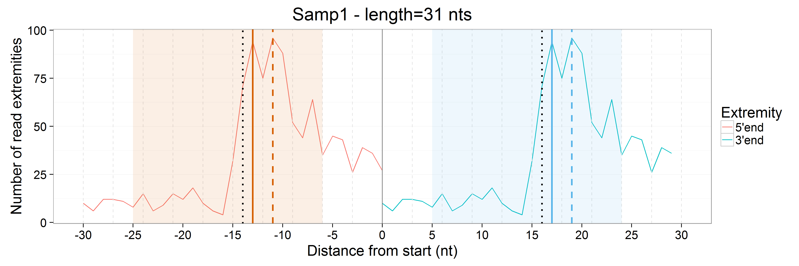
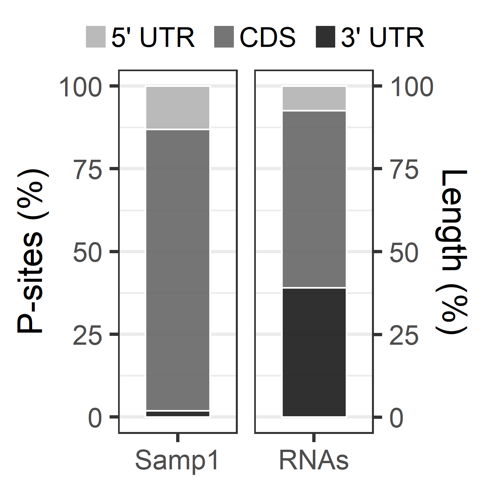
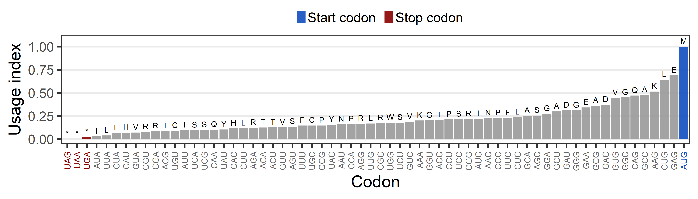
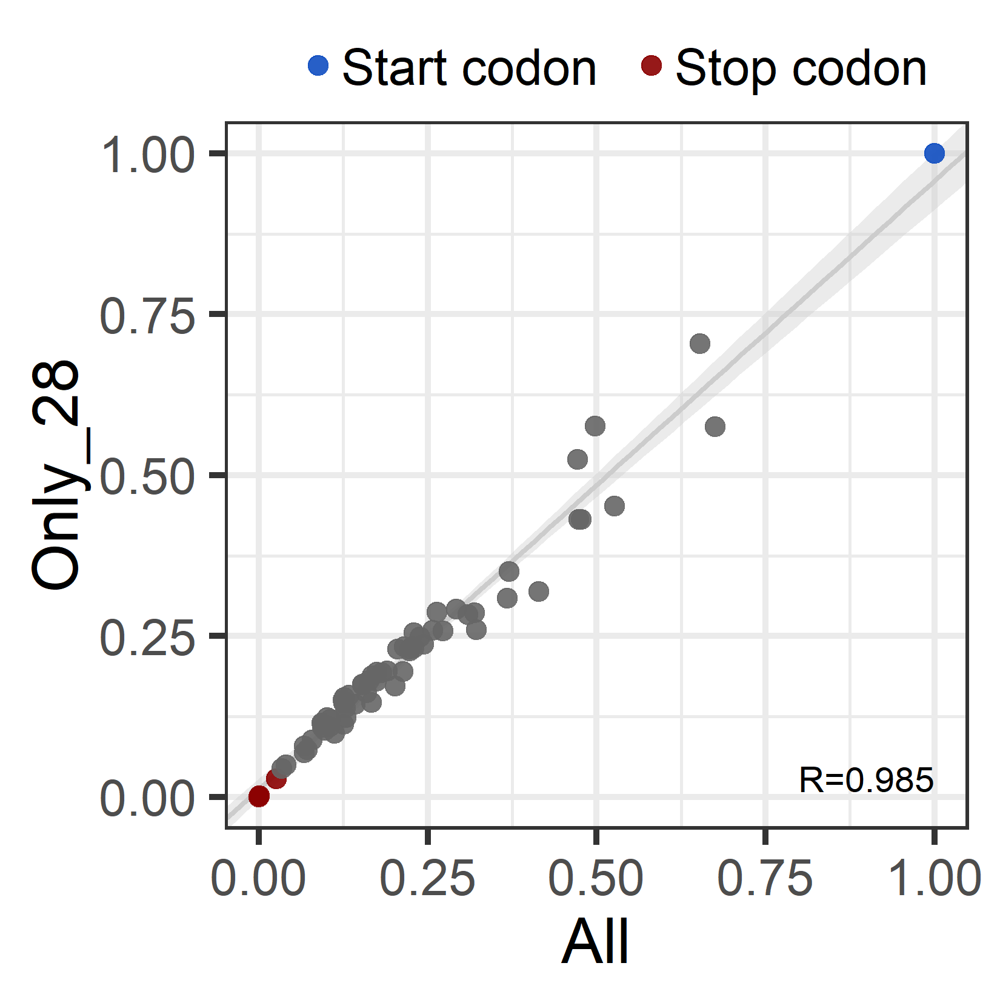
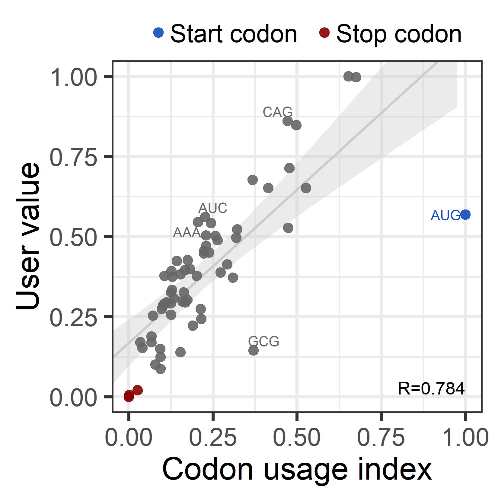

<style>
body {
text-align: justify}
</style>

## Overview

  Ribosome profiling is a powerful technique used to study translation at the genome-wide level, generating unique information concerning ribosome positions along RNAs. Optimal localization of ribosomes requires the proper identification of the ribosome P-site in each ribosome protected fragment, a crucial step to determine trinucleotide periodicity of translating ribosomes and draw correct conclusions concerning where ribosomes are located. To determine the P-site within ribosome footprints at nucleotide resolution, the precise estimation of its offset with respect to the protected fragment is necessary.

__riboWaltz__ is an R package for calculation of optimal P-site offsets, diagnostic analysis and visual inspection of ribosome profiling data. Taking advantage of a two-step algorithm where offset information is passed through populations of reads with different length in order to maximize offset coherence, __riboWaltz__ computes with high precision the P-site offset. __riboWaltz__ also provides a variety of graphical representations, laying the foundations for further accurate RiboSeq analyses and improved interpretation of positional information.


## Citing riboWaltz

Please cite the following article (available [here](https://journals.plos.org/ploscompbiol/article?id=10.1371/journal.pcbi.1006169)) when using __riboWaltz__:
  
  Lauria F, Tebaldi T, Bernabò P, Groen EJN, Gillingwater TH, Viero G. ***riboWaltz: Optimization of ribosome P-site positioning in ribosome profiling data.*** *PLoS Comput Biol. 2018 Aug 13;14(8):e1006169.*
  
  
  ## Before starting
  
  ### Dependencies
  
  __riboWaltz__ requires R version >= 3.3.0 and the following packages:
  
  * CRAN
+ data.table (>= 1.10.4.3)
+ ggplot2 (>= 2.2.1)
+ ggrepel (>= 0.6.5)
* Bioconductor
+ Biostrings (>= 2.46.0)
+ GenomicAlignments (>= 1.14.1)
+ GenomicFeatures (>= 1.24.5)
+ GenomicRanges (>= 1.24.3)
+ IRanges (>= 2.12.0)

All dependencies are automatically installed running the code in the next section.


### Installation

To install __riboWaltz__ directly from GitHub the *devtools* package is required. If not already installed on your system, run

```{r, eval = FALSE}
install.packages("devtools")
```	

Otherwise, load *devtools* and install __riboWaltz__ by

```{r, eval = FALSE}
library(devtools)
install_github("LabTranslationalArchitectomics/riboWaltz", dependencies = TRUE)
```

Please note: to install __riboWaltz__ generating the vignette replace the last command with:
  
```{r, eval = FALSE}
install_github("LabTranslationalArchitectomics/riboWaltz", dependencies = TRUE,
               build_opts = c("--no-resave-data", "--no-manual"))
```


### Loading

To load __riboWaltz__ run

```{r, eval = TRUE, warning = FALSE}
library(riboWaltz)
```


### Getting help

Next sections illustrate how to make use of __riboWalz__ by introducing all functions included in the package and reporting most of the data structures and graphical outputs generated with the default options. Similar information are reported in the [README](https://github.com/LabTranslationalArchitectomics/riboWaltz/blob/master/README.md). For additional examples and further details about the meaning and usage of all parameters in a function run

```{r, eval = FALSE}
?function_name
```

or

```{r, eval = FALSE}
help(package = riboWaltz)
```

A complete reference manual is available [here](https://github.com/LabTranslationalArchitectomics/riboWaltz/blob/master/ReferenceManual.pdf).

Bugs and errors can be reported at the [issues](https://github.com/LabTranslationalArchitectomics/riboWaltz/issues) page on GitHub. Before filing new issues, please read the documentation and take a look at currently open and already closed discussions.

## From BAM files to P-site offsets

### Remark

__riboWaltz__ currently works for read alignments based on transcript coordinates. This choice is due to the main purpose of RiboSeq assays to study translational events through the isolation and sequencing of ribosome protected fragments. Most reads from RiboSeq are supposed to map on mRNAs and not on introns and intergenic regions. BAM based on transcript coordinates can be generated in two ways: i) aligning directly against transcript sequences; ii) aligning against standard chromosome sequences, requiring the outputs to be translated in transcript coordinates.

The first option can be easily handled by many aligners (e.g. Bowtie), given a reference FASTA file where each sequence represents a transcript, from the beginning of the 5' UTR to the end of the 3' UTR. The second procedure is based on reference FASTA files where each sequence represents a chromosome, usually coupled with comprehensive gene annotation files (GTF or GFF). The STAR aligner with its option *-quantMode TranscriptomeSAM* (see Chapter 6 of its [manual](http://labshare.cshl.edu/shares/gingeraslab/www-data/dobin/STAR/STAR.posix/doc/STARmanual.pdf)), is an example of tool providing such a feature.

### Acquiring input files

One or multiple BAM files are read, converted into data tables or GRanges objects and arranged in a list or a GRangesList, respectively, by running function `bamtolist`. It only requires the path to the folder storing the BAM files and an annotation data table (see below for additional information). It is suggested to rename the BAM files before their acquisition in order to maintain the same nomenclatures through the whole analysis. However, it is possible to assign new names to the samples during their acquisition thanks to the *name_samples* parameter. If the BAM file(s) come from a transcriptome alignment (intended as an alignment against reference transcript sequences), reads mapping on the negative strand should not be present and, if any, they are automatically removed. The syntax for running `bamtolist` is:
  
  reads_list <- bamtolist(bamfolder = "path/to/BAM/files", annotation = annotation_dt)

The resulting data tables contain, for each read: i) the name of the corresponding reference sequence (i.e. of the transcript on which it aligns); ii) its leftmost and rightmost position with respect to the 1st nucleotide of the reference sequence; iii) its length; iv) the leftmost and rightmost position of the annotated CDS of the reference sequence (if any) with respect to its 1st nucleotide. Please note: start and stop codon positions for transcripts without annotated CDS are set to 0. An example of `bamtolist` output is provided by the *reads_list* dataset included in the package. It is a list of one element called *Samp1* that mainly contains information about reads aligning on the translation initiation site (this is a subset of the original dataset produced by the authors, available [here](https://www.ncbi.nlm.nih.gov/geo/query/acc.cgi?acc=GSE102318)). The data table looks as follow:
  
```{r}
head(reads_list[["Samp1"]])
```
Alternatively, BAM files can be first converted into BED files by the function `bamtobed` and then into a list of data tables or a GRangesList object through the function `bedtolist`. Please note: `bamtobed` relies on the *bamtobed* utility of the *BEDTools* suite ([here](http://bedtools.readthedocs.io/en/latest/content/installation.html) the instructions for the installation). Since the *BEDTools* suite has been developed for command line environments, `bamtobed` can be only run on UNIX, LINUX and Apple OS X operating systems. Once BED files are generated, it is possible to switch to any other machine without further restrictions. Nevertheless, the authors suggest the use of `bamtolist`.

`bamtobed` generate BED files that contain, for each read: i) the name of the corresponding reference sequence (i.e. of the transcript on which it aligns); ii) its leftmost and rightmost position with respect to the 1st nucleotide of the reference sequence; iii) its length; iv) the strand on which it aligns. `bamtobed` requires the path to the folder storing the BAM files and, optionally, the path to the directory where the BED files should be stored. The The syntax for running `bamtobed` is: 
  
  bamtobed(bamfolder = "path/to/BAM/files", bedfolder = "path/to/output/directory")

Then, one or multiple BED files produced by `bamtobed` are read, converted into data tables or GRanges objects and arranged in a list or a GRangesList, respectively, by running `bedtolist`. It also attaches two columns to the original data containing, for each read, the leftmost and rightmost position of the annotated CDS of the reference sequence (if any) with respect to its 1st nucleotide. Please note: start and stop codon positions for transcripts without annotated CDS are set to 0. `bedtolist` requires the path to the folder storing the BED files and an annotation file. Its syntax is as follow:
  
  reads_list <- bedtolist(bedfolder = "path/to/BED/files", annotation = annotation_dt)


### Selection of read lengths

Different lengths of ribosome protected fragments may derive from alternative ribosome conformations. Therefore, the researcher should be free to modify the tolerance for the selection of read lengths according to the aim of the experiment. For this reason, __riboWaltz__ provides multiple options for treating read lengths, included in function `length_filter`:
  
  1. Manual mode: only read lengths specified by the user are kept

```{r, eval = FALSE, echo = TRUE}
filtered_list <- length_filter(data = reads_list, length_filter_mode = "custom",
                               length_filter_vector = 27:30)
```

2. Periodicity threshold mode: only read lengths satisfying a periodicity threshold (i.e. a higher percentage of read extremities falls in one of the three reading frames along the CDS) are kept.

```{r, eval = FALSE, echo = TRUE}
filtered_list <- length_filter(data = reads_list, length_filter_mode = "periodicity",
                               periodicity_threshold = 70)
```
For additional details please refer to the documentation provided by ?length_filter.


### Annotation data table

A reference annotation file is required by many functions included in the package. The annotation file must be a data table of at least five columns reporting, for each reference transcript, its name, its length and the length of its annotated 5' UTR, CDS and 3'UTR. Please note: if a transcript region is not annotated its length is set to 0. The annotation file can be either provided by the user or generated starting from GTF files or TxDb objects by running the function `create_annotation`. Please make sure the GTF or the TxDb object the derives from the same release of the sequences used in the alignment step. Here an example of the output:
  
```{r, eval = TRUE, echo = FALSE, message = FALSE, warning = FALSE}
data(reads_list)
data(mm81cdna)
library(data.table)
```
```{r}
head(mm81cdna)
```


### P-site offset

The P-site offsets (POs) are computed by the function `psite` starting from a list of data tables generated by `bamtolist`, `bedtolist` or `length_filter`. The PO is defined as the distance between the extremities of a read and the first nucleotide of the P-site itself. `psite` processes all samples separately starting from reads mapping on the reference codon (either the start codon or the second to last codon, specified by *start*) of any annotated coding sequences. Read lengths-specific POs are inferred in two steps. First, reads mapping on the reference codon are grouped according to their length, each group corresponding to a bin. Reads whose extremities are too close to the reference codon are discarded (see the *flanking* parameter). For each bin temporary 5' and 3' POs are defined as the distances between the first nucleotide of the reference codon and the nucleotide corresponding to the global maximum found in the profiles of the 5' and the 3' end at the left and at the right of the reference codon, respectively. After the identification of the P-site for all reads aligning on the reference codon, the POs corresponding to each length are assigned to each read of the dataset. Second, the most frequent temporary POs associated to the optimal extremity (see the *extremity* parameter) and the predominant bins are exploited as reference values for correcting the temporary POs of smaller bins. Briefly, the correction step defines for each length bin a new PO based on the local maximum, whose distance from the reference codon is the closest to the most frequent temporary POs. For further details please refer to the __riboWaltz__ article, available [here](https://journals.plos.org/ploscompbiol/article?id=10.1371/journal.pcbi.1006169).

For each sample `psite` prints on the screen the extremity chosen for the computation of the P-site offsets and the value upon which the correction is based.

```{r, echo = TRUE}
psite_offset <- psite(reads_list, flanking = 6, extremity = "auto")
```
`psite` returns a data table containing, for all samples and read lengths: i) the percentage of reads in the whole dataset, ii) the percentage of reads aligning on the start codon (if any); iii) the distance of the P-site from the two extremities of the reads before and after the correction step; iv) the name of the sample.

```{r, echo = TRUE}
head(psite_offset, 10)
```
Optionally, ribosome occupancy profiles based on the 5' and 3' extremity of reads mapping on the reference codon is generated for all samples and read lengths (see the *plot* parameter). Examples for reads of 28 and 31 nucleotides are showed below. Optimal offsets (dotted black lines) and inferred offsets before and after the correction step are reported as dashed and continuous vertical lines, respectively. The regions around the reference codon defined by the *flanking* parameter are shaded.

```{r, out.width = '690px', fig.retina = NULL, echo = FALSE}


```
<br>
  <br>
  After the identification of the P-site offsets, the original data tables containing reads information must be updated accordingly. `psite_info` attaches to each data table four columns reporting i) the P-site position with respect to the 1st nucleotide of the transcript, ii) the P-site position with respect to the start and the stop codon of the annotated coding sequence (if any) and iii) the region of the transcript (5' UTR, CDS, 3' UTR) that includes the P-site. Please note: for transcripts not associated to any annotated CDS the position of the P-site with respect to the start and the stop codon is set to NA. Here an example:
  
```{r, echo = FALSE, eval = TRUE, include = FALSE}
data(reads_psite_list)
```
```{r, echo = TRUE, eval = FALSE}
reads_psite_list <- psite_info(reads_list, psite_offset)
head(reads_psite_list[["Samp1"]])
```
```{r, echo = FALSE, eval = TRUE}
head(reads_psite_list[["Samp1"]])
```
Optionally, additional columns reporting the three nucleotides covered by the P-site, the A-site and the E-site are attached. This feature requires transcript or chromosome nucleotide sequences in FASTA format. Alternatively, a BSGenome data package can be used for sequence retrieval. Nucleotide sequences of a genome assembly and BSGenome data package must be coupled with a GTF file or a TxDb object providing genomic annotations. For further details please refer to the documentation of `psite_info` running ?psite_info.

Nucleotide sequences covered by the P-site, A-site or the E-site are required for performing further analyses such as to compute the number of in-frame P-sites, the percentage of P-sites falling in the three transcript regions, verify the trinucleotide periodicity of the reads along the coding sequence and generate metaplots, as discussed in the next sections.


## Codon and CDS coverage
__riboAbacus__ includes two functions, `codon_coverage` and `cds_coverage`, providing quantitative information based on P-sites positions. 

### Codon coverage

`codon_coverage` computes the number of read footprints or P-sites mapping on each triplet of annotated coding sequences and UTRs. Such data can be exploited to generate occupancy profiles at codon resolution showing the abundance of ribosome protected fragments along single transcripts (a function providing single profiles is currently under development by the authors). `codon_coverage` divides the sequence of every transcript in triplets starting from the annotated translation initiation site (if any) and proceeding towards the UTRs extremities, possibly discarding the exceeding 1 or 2 nucleotides at the extremities of the transcript. The resulting data table contains, for each triplet: i) the name of the corresponding reference sequence (i.e. of the transcript to which it belongs); ii) its leftmost and rightmost position with respect to the 1st nucleotide of the reference sequence; iii) its position with respect to the 1st and the last codon of the annotated CDS of the reference sequence; iv) the region of the transcript (5' UTR, CDS, 3' UTR) it is in; v) the number of read footprints or P-sites falling in that region for all samples. Here an example:
  
```{r, echo = TRUE, eval = FALSE}
codon_coverage_example <- codon_coverage(reads_psite_list, mm81cdna, psite = FALSE)
head(codon_coverage_example[Samp1 > 0])
```
```{r, echo = FALSE, eval = TRUE}
codon_coverage_example <- data.table(transcript = rep("ENSMUST00000000001.4", 6),
                                     start = c(90, 93, 96, 99, 102, 105),
                                     end = c(93, 96, 99, 102, 105, 108),
                                     from_cds_start = -17:-12,
                                     from_cds_stop = -371:-366,
                                     region = rep("5utr", 6),
                                     Samp1 = c(1, 2, 2, 2, 2, 2))
head(codon_coverage_example)
```

### CDS coverage

`cds_coverage` computes the number of in-frame P-sites mapping on annotated coding sequences. Such data can be used as starting point for downstream quantitative analyses (e.g. differential analyses) based on in-frame ribosome protected fragments. `cds_coverage` returns a data table containing, for each transcript: i) its name; ii) its length; iii) the number of in-frame P-sites mapping on its annotated coding region for all samples:
  
```{r, echo = FALSE, eval = TRUE, include = FALSE}
cds_coverage_example <- cds_coverage(reads_psite_list, mm81cdna)
```
```{r, echo = TRUE, eval = FALSE}
cds_coverage_example <- cds_coverage(reads_psite_list, mm81cdna)
head(cds_coverage_example)
```
```{r, echo = FALSE, eval = TRUE}
head(cds_coverage_example)
```


## Graphical outputs

### Note

All functions in __riboWaltz__ generating graphical outputs return a list of at least two elements: a ggplot2 object named *plot* and a data table with the associated data, named *dt*. The following sections describe all these functions by illustrating their syntax and graphical output. For further examples and additional details about parameters and data structures please refer to the documentation of the single functions (by running ?name_function) or to the __riboWaltz__ reference manual ([here](https://github.com/LabTranslationalArchitectomics/riboWaltz/blob/master/ReferenceManual.pdf)).

### Overview of the data

Two preliminary plots can be generated before the identification of the P-sites.

The first plot, provided by `rlength_distr`, shows the distribution of reads lengths for a specified sample. It can be exploited for i) identifying multiple populations of read length, associated to different ribosome conformations and ii) exploring the contribution of each length bin to the final P-site determination. Here an example with the default parameters:
  
```{r, echo = TRUE, fig.show = 'hold', fig.width = 4, fig.asp = 1, fig.align = 'center', out.width = '275px', warning = FALSE}
example_length_dist <- rlength_distr(reads_list, sample = "Samp1")
example_length_dist[["plot"]]
```
<br>
  Note that wide ranges of read lengths might result in squeezed distributions. To restrict the plot to a sub-range of read lengths  `rlength_distr` provides the *cl* parameter. It specifies a confidence level that automatically select the most abundant populations of reads discarding from the plot the (100-cl)% of read lengths associated to the lowest signals. The distribution showed above for a confidence level of 99% appears as follow:
  
```{r, echo = TRUE, fig.show = 'hold', fig.width = 4, fig.asp = 1, fig.align = 'center', out.width = '275px', warning = FALSE}
example_length_dist_zoom <- rlength_distr(reads_list, sample = "Samp1", cl = 99)
example_length_dist_zoom[["plot"]]
```
<br>
  The second plot, provided by `rends_heat`, consists of four metaheatmaps. It displays the abundance of the 5' and 3' extremity of reads mapping on and around the start and the stop codon of annotated CDSs, stratified by their length. As for the previous plot, it is possible to restrict the graphical output to a sub-range of read lengths by specifying the *cl* parameter:
  
```{r, echo = TRUE, fig.show = 'hold', fig.width = 15, fig.asp = 1/2.5, fig.align = 'center', out.width = '700px', message = FALSE, warning = FALSE}
example_ends_heatmap <- rends_heat(reads_list, mm81cdna, sample = "Samp1", cl = 85,
                                   utr5l = 25, cdsl = 40, utr3l = 25)
example_ends_heatmap[["plot"]]
```
<br>
  This plot is particularly useful for manually detect the optimal read extremity to correct temporary P-site offsets (see the *extremity* parameter of function `psite`). In our example the signals coming from the 5' and the 3' extremity of reads mapping around the translation initiation site (TIS) show a clear difference. The distance between 5' ends and TIS varies according to read length (shorter the read, lower the distance) while the distance between 3' ends and TIS is almost constant. This property points to the more stable 3' end as the optimal extremity. In agreement with this conclusion, the 3' end is also automatically identified as the optimal extremity by the function `psite` run on the example dataset with the default options (see section *__P-site offset__* above).


### P-sites per region

Ribosome profiling data should highlight the CDS of transcripts as the region with the higher percentage of reads. To verify this property the function `region_psite` computes the percentage of P-sites falling in the three annotated transcript regions (5' UTR, CDS and 3' UTR). The bar plot of the resulting values includes a bar called "RNAs" displaying the expected read distribution from a random fragmentation of RNA. It reports the percentage of regions length for the transcripts included in the analysis, based on the cumulative nucleotide length of 5' UTRs, CDSs and 3' UTRs. Here an example with the default parameters, where the expected P-site enrichment on the CDS emerges:
  
```{r, echo = FALSE, eval = TRUE, include = FALSE, warning = FALSE}
example_psite_region <- region_psite(reads_psite_list, mm81cdna, sample = "Samp1")
```
```{r, echo = TRUE, eval = FALSE}
example_psite_region <- region_psite(reads_psite_list, mm81cdna, sample = "Samp1")
example_psite_region[["plot"]]
```
```{r, out.width = '260px', fig.retina = NULL, echo = FALSE, fig.align = "center"}

```


### Trinucleotide periodicity

A fundamental characteristic of ribosome profiling data is the trinucleotide periodicity of ribosome footprints along coding sequences. Functions `frame_psite_length` and `frame_psite` show if, and to which extent, the identified P-sites results in codon periodicity on the CDS. Both functions compute the percentage of P-sites falling in the three possible translation reading frames for 5’ UTRs, CDSs and 3’ UTRs with one difference: `frame_psite_length` analyses all read lengths separately and generates a heatmap for each transcript region, while `frame_psite` processes all reads at once, returning three bar plots. Here the outputs for the example dataset:
  
```{r, echo = TRUE, fig.show = 'hold', fig.width = 10, fig.asp = 1/1.9, fig.align = 'center', out.width = '450px', message = FALSE, warning = FALSE}
example_frames_stratified <- frame_psite_length(reads_psite_list, sample = "Samp1",
                                                region = "all", cl = 90)
example_frames_stratified[["plot"]]
```
<br>
```{r, echo = TRUE, fig.show = 'hold', fig.width = 10, fig.asp = 1/2.3, fig.align = 'center', out.width = '450px', message = FALSE, warning = FALSE}
example_frames <- frame_psite(reads_psite_list, sample = "Samp1", region = "all")
example_frames[["plot"]]
```
<br>
  Both plots show an enrichment of P-sites in the first frame on the coding sequence but not the UTRs, as expected for ribosome protected fragments from protein coding mRNAs.


### Metaplots

A visual representation of the trinucleotide periodicity along coding sequences is provided by the function `metaprofile_psite`. It generates metaprofiles (the merge of single, transcript-specific profiles) based on P-sites mapping around the start and the stop codon of annotated CDSs. Multiple replicates can be combined in a single plot by providing scale factors from any normalization chosen by the user. Metaprofiles can be based on the whole dataset (as in the example below), on subsets of transcripts or on single RNAs.

```{r, echo = TRUE, fig.show = 'hold', fig.width = 15, fig.asp = 1/3.25, fig.align = 'center', out.width = '690px', message = FALSE, warning = FALSE}
example_metaprofile <- metaprofile_psite(reads_psite_list, mm81cdna, sample = "Samp1",
                                         utr5l = 20, cdsl = 40, utr3l = 20,
                                         plot_title = "sample.transcript")
example_metaprofile[["plot_Samp1"]]
```
<br>
  `metaprofile_psite` provides the *length_range* parameter which allows to select sub-populations of read according to their lengths. Here an example using reads of 28 nucleotides, the most frequent read length in the example dataset:
  
```{r, echo = TRUE, fig.show = 'hold', fig.width = 15, fig.asp = 1/3.25, fig.align = 'center', out.width = '690px', message = FALSE, warning = FALSE}
example_metaprofile_28 <- metaprofile_psite(reads_psite_list, mm81cdna, sample = "Samp1",
                                            length_range = 28, utr5l = 20, cdsl = 40,
                                            utr3l = 20, plot_title = "sample.transcript")
example_metaprofile_28[["plot_Samp1"]]
```
<br>
It is also possible to use `metaprofile_psite` for comparing multiple samples or populations of reads (e.g. with different length): for the same set of transcripts, `metaprofile_psite` can generate a collection of metaprofiles using reads from either a variety of biological conditions or subsets of the same dataset.

Here an example: let's suppose we want to investigate if, and to which extent, trinucleotide periodicity of reads of 28 nucleotides differs from trinucleotide periodicity based on all read lengths. As first step we create a list of data tables with the reads of interest:

```{r, echo = TRUE}
comparison_list <- list()
comparison_list[["subsample_28nt"]] <- reads_psite_list[["Samp1"]][length == 28]
comparison_list[["whole_sample"]] <- reads_psite_list[["Samp1"]]
```
  Then we define a list containing either character strings specifying the name of the sample(s) of interest (as in this example) or character string vectors specifying the name of their replicates (see parameter *sample*).

```{r, echo = TRUE}
sample_list <- list("Only_28" = c("subsample_28nt"),
                   "All" = c("whole_sample"))
```
  We can now run `metaprofile_psite`:
```{r, echo = TRUE, fig.show = 'hold', fig.width = 15, fig.asp = 1/3.25, fig.align = 'center', out.width = '690px', message = FALSE, warning = FALSE}
example_metaprofile_comparison <- metaprofile_psite(comparison_list, mm81cdna, sample = sample_list,
                                         utr5l = 20, cdsl = 40, utr3l = 20,
                                         frequency = TRUE, plot_title = "transcript",
                                         mirrored = TRUE, colour = c("green4", "gray40"))
example_metaprofile_comparison[["plot"]]
```
<br>
  Another way to visualize the trinucleotide periodicity along coding sequences is generating a metahaetmap. In this case the abundance of P-sites is represented by a continuous color scale and not by the height of a line chart as in metaprofiles. If multiple sets of transcripts are provided, the resulting heatmaps are arranged in one graphical output. Using the sample list generated in the previous example, `metaheatmap_psite` returns:

```{r, echo = TRUE, fig.show = 'hold', fig.width = 15, fig.asp = 1/2.5, fig.align = 'center', out.width = '700px', message = FALSE, warning = FALSE}
example_metaheatmap <- metaheatmap_psite(comparison_list, mm81cdna, sample = sample_list,
                                            utr5l = 20, cdsl = 40, utr3l = 20, log = F)
example_metaheatmap[["plot"]]
```
<br>
 The output includes two heatmaps, one for each data table. The plot shows a clear trinucleotide periodicity for both datasets and a signal on the 5th codon stonger than on the TIS only for reads of 28 nucleotides, in agreement with the metaprofiles showed above. 


### Codon usage

  To understand what codons display higher or lower ribosome density, the function `codon_usage_psite` provides the user with the analysis of the empirical codon usage. It is defined as the frequency of in-frame P-sites along the coding sequence codon by codon optionally normalized for the frequency in sequences of each codon. If one sample name is specified `codon_usage_psite` returns a bar plot of the resulting codon usage indexes, highlighting the start and stop codons and labelling each bar with the corresponding amino acid. The graphical representation of the empirical codon usage based on the example dataset is showed below. Please note: due to its size, the FASTA file containing the transcripts sequences used by the author is not included in the package.

```{r, echo = TRUE, eval = FALSE}
codon_usage_barplot <- codon_usage_psite(reads_psite_list, mm81cdna, sample = "Samp1",
                                          fastapath = "path/to/transcriptome/FASTA/file",
                                          fasta_genome = FALSE,
                                          frequency_normalization = FALSE) 
codon_usage_barplot[["plot"]]
```
```{r, out.width = '690px', fig.retina = NULL, echo = FALSE}

```
<br>
<br>
  `codon_usage_psite` can also be exploited for investigating alterations of ribosome translocation at specific codons by comparing empirical codon usage from multiple samples or multiple populations of reads (e.g. with different length). Specifying two sample names, `codon_usage_psite` returns two bar plots (one for each sample) and compares the two sets of codon usage indexes returning a scatter plot. Each dot of the scatter plot represents a codon, optionally labelled with the corresponding triplet or amino acid. The relationship between the two sets of values (as results of a linear regression) and the Pearson correlation coefficient are displayed.
  
  Here an example: let's suppose we want to investigate if, and to which extent, codon usage indexes based on reads of 28 nucleotides differs from codon usage indexes based on all reads. First, we create a list of data tables with the reads of interest and than we run `codon_usage_psite`:
  
```{r, echo = TRUE, eval = FALSE}
comparison_list <- list()
comparison_list[["Only_28"]] <- reads_psite_list[["Samp1"]][length == 28]
comparison_list[["All"]] <- reads_psite_list[["Samp1"]]

codon_usage_2samples <- codon_usage_psite(comparison_list, mm81cdna, sample = c("All", "Only_28"),
                                          fastapath = "path/to/transcriptome/FASTA/file",
                                          fasta_genome = FALSE,
                                          frequency_normalization = FALSE)
codon_usage_2samples[["plot_comparison"]]
```
```{r, out.width = '300px', fig.retina = NULL, echo = FALSE, fig.align = "center"}

```
<br>
  `codon_usage_psite` also allows to compare codon usage indexes of a sample of interest with codon-specific values provided by the user (see parameter *codon_values*). In the following example empirical codon indexes for the example dataset are compared with codon usage bias values in mouse (downloaded from http://www.kazusa.or.jp/codon, based on the frequency of synonymous codons in coding DNA regions). The structure of the required input data table is as follows:
  
```{r, eval=TRUE, echo=FALSE}
cub_mouse <- data.table(codon = c("UUU", "UCU", "UAU", "UGU", "UUC", "UCC", "UAC", "UGC", "UUA", "UCA", "UAA", "UGA", "UUG", "UCG", "UAG", "UGG", "CUU", "CCU", "CAU", "CGU", "CUC", "CCC", "CAC", "CGC", "CUA", "CCA", "CAA", "CGA", "CUG", "CCG", "CAG", "CGG", "AUU", "ACU", "AAU", "AGU", "AUC", "ACC", "AAC", "AGC", "AUA", "ACA", "AAA", "AGA", "AUG", "ACG", "AAG", "AGG", "GUU", "GCU", "GAU", "GGU", "GUC", "GCC", "GAC", "GGC", "GUA", "GCA", "GAA", "GGA", "GUG", "GCG", "GAG", "GGG"),
                        value = c(17.2, 16.2, 12.2, 11.4, 21.8, 18.1, 16.1, 12.3, 6.7, 11.8, 1.0, 1.6, 13.4, 4.2, 0.8, 12.5, 13.4, 18.4, 10.6, 4.7, 20.2, 18.2, 15.3, 9.4, 8.1, 17.3, 12.0, 6.6, 39.5, 6.2, 34.1, 10.2, 15.4, 13.7, 15.6, 12.7, 22.5, 19.0, 20.3, 19.7, 7.4, 16.0, 21.9, 12.1, 22.8, 5.6, 33.6, 12.2, 10.7, 20.0, 21.0, 11.4, 15.4, 26.0, 26.0, 21.2, 7.4, 15.8, 27.0, 16.8, 28.4, 6.4, 39.4, 15.2))
```
```{r}
head(cub_mouse)
```
When *codon_values* is specified `codon_usage_psite` returns a scatter plot, as in the previuos example. In both cases labels for a specified number of dots, reporting the coresponding triplet or amino acid symbol, can be added (see parameters *label_scatter*, *label_number* and *label_aminoacid*):
  
```{r, echo=TRUE, eval=FALSE}
codon_usage_cub <- codon_usage_psite(reads_psite_list, mm81cdna, sample = "Samp1",
                                     fastapath = "path/to/transcriptome/FASTA/file",
                                     fasta_genome = FALSE, codon_values = cub_mouse,
                                     frequency_normalization = FALSE,
                                     label_scatter = TRUE, label_number = 5)
codon_usage_cub[["plot_comparison"]]
```
```{r, out.width = '300px', fig.retina = NULL, echo = FALSE, fig.align = "center"}

```


