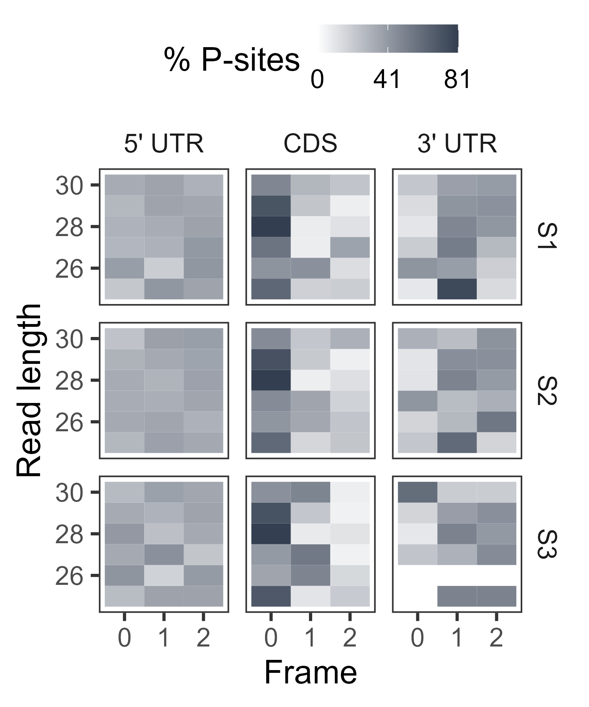
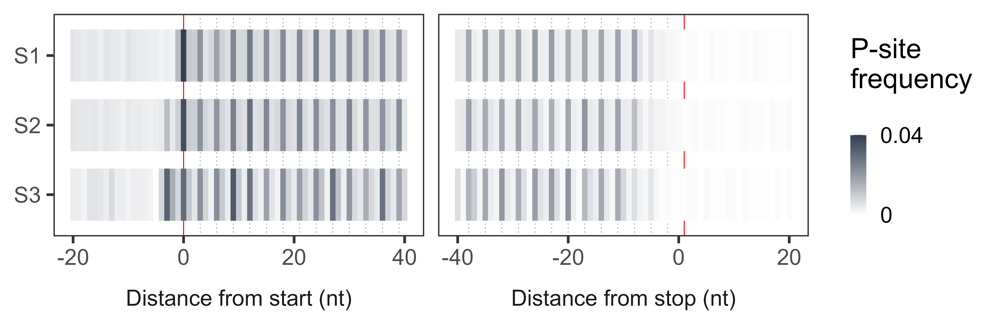

<style>
body {
text-align: justify}
img {
border: 0;}
</style>

<br>
<br>

# Overview

 Ribosome profiling is a powerful technique used to study translation at the genome-wide level, generating unique information concerning ribosome positions along RNAs. Optimal localization of ribosomes requires the proper identification of the ribosome P-site in each ribosome protected fragment, a crucial step to determine trinucleotide periodicity of translating ribosomes and draw correct conclusions concerning where ribosomes are located. To determine the P-site within ribosome footprints at nucleotide resolution, the precise estimation of its offset with respect to the protected fragment is necessary. 

 __riboWaltz__ is an R package for calculation of optimal P-site offsets, diagnostic analysis and visual inspection of ribosome profiling data. Taking advantage of a two-step algorithm where offset information is passed through populations of reads with different length in order to maximize offset coherence, __riboWaltz__ computes with high precision the P-site offset. __riboWaltz__ also provides a variety of graphical representations, laying the foundations for further accurate RiboSeq analyses and improved interpretation of positional information.

<br>
<br>

# Citing riboWaltz

Please cite the following article (available [here](https://journals.plos.org/ploscompbiol/article?id=10.1371/journal.pcbi.1006169)) when using __riboWaltz__:
  
  Lauria F, Tebaldi T, Bernabò P, Groen EJN, Gillingwater TH, Viero G. ***riboWaltz: Optimization of ribosome P-site positioning in ribosome profiling data.*** *PLoS Comput Biol. 2018 Aug 13;14(8):e1006169.*

<br>
<br>

# Before starting

## Dependencies
  
  __riboWaltz__ requires R version >= 3.3.0 and the following packages:
  
  * CRAN
    + data.table (>= 1.10.4.3)
    + ggplot2 (>= 2.2.1)
    + ggrepel (>= 0.6.5)
  * Bioconductor
    + Biostrings (>= 2.46.0)
    + GenomicAlignments (>= 1.14.1)
    + GenomicFeatures (>= 1.24.5)
    + GenomicRanges (>= 1.24.3)
    + IRanges (>= 2.12.0)

All dependencies are automatically installed running the code in the next section.


## Installation

### R

To install __riboWaltz__ directly from GitHub the *devtools* package is required. If not already installed on your system, run

```{r, eval = FALSE}
install.packages("devtools")
```	

Otherwise, load *devtools* and install __riboWaltz__ by

```{r, eval = FALSE}
library(devtools)
install_github("LabTranslationalArchitectomics/riboWaltz", dependencies = TRUE)
```

Please note: to install __riboWaltz__ generating the vignette replace the last command with:
  
```{r, eval = FALSE}
install_github("LabTranslationalArchitectomics/riboWaltz", dependencies = TRUE,
               build_vignettes = TRUE)
```

### Conda

 __riboWaltz__ is also available through Conda and can be installed into the current environment by following [these instructions](https://bioconda.github.io/recipes/ribowaltz/README.html).

## Loading

To load __riboWaltz__ run:

```{r, eval = TRUE, warning = FALSE}
library(riboWaltz)
```


## Getting help

The following sections illustrate how to make use of __riboWalz__ by introducing all functions included in the package and reporting most of the data structures and graphical outputs generated with the default options. Similar information are reported in the [README](https://github.com/LabTranslationalArchitectomics/riboWaltz/blob/master/README.md). For additional examples and further details about the meaning and usage of all parameters in a function, run:

```{r, eval = FALSE}
?function_name
```

or

```{r, eval = FALSE}
help(package = riboWaltz)
```

A complete reference manual is available [here](https://github.com/LabTranslationalArchitectomics/riboWaltz/blob/master/ReferenceManual.pdf).

Bugs and errors can be reported at the [issues](https://github.com/LabTranslationalArchitectomics/riboWaltz/issues) page on GitHub. Before filing new issues, please read the documentation and take a look at currently open and already closed discussions.

<br>
<br>

# From BAM files to P-site offsets

## Remarks

### Note 1

 __riboWaltz__ currently works for read alignments based on transcript coordinates. This choice is due to the main purpose of RiboSeq assays to study translational events through the isolation and sequencing of ribosome protected fragments. Reads from RiboSeq are supposed to map on mRNAs and not on introns and intergenic regions. BAM based on transcript coordinates can be generated alinging the reads i) directly against transcript sequences or ii) against standard chromosome sequences and forcing the outputs to be translated in transcript coordinates.

 The first option can be easily handled by many aligners (e.g. Bowtie), given a reference FASTA file where each sequence represents a transcript, from the beginning of the 5' UTR to the end of the 3' UTR. The second procedure is based on reference FASTA files where each sequence represents a chromosome, usually coupled with comprehensive gene annotation files (GTF or GFF). The STAR aligner with its option *-quantMode TranscriptomeSAM* (see the section "Output in transcript coordinates" of its manual), is an example of tool providing such a feature.

### Note 2

Multiple functions described below can accept and return both list of data tables and GRangesList objects. For convenience, all example datasets included in the package, as well as the whole ReadMe, are based on and refer to data tables.


## Acquiring input files

 One or multiple BAM files are read, converted into data tables and arranged in a list by running function `bamtolist`. It only requires the path to the folder storing the BAM files and an annotation data table (see below for additional information). It is suggested to rename the BAM files before their acquisition in order to maintain the same nomenclatures through the whole analysis. However, it is possible to assign new names to the samples during their acquisition thanks to the *name_samples* parameter. If the BAM file(s) come from a transcriptome alignment (intended as an alignment against reference transcript sequences), reads mapping on the negative strand should not be present and, if any, they are automatically removed. The syntax for running `bamtolist` is:

```{r, eval = FALSE}
  reads_list <- bamtolist(bamfolder = "path/to/BAM/files", annotation = annotation_dt)
```

 The resulting data tables contain, for each read: i) the name of the corresponding reference sequence (i.e. of the transcript on which it aligns); ii) its leftmost and rightmost position with respect to the 1st nucleotide of the reference sequence; iii) its length; iv) the leftmost and rightmost position of the annotated CDS of the reference sequence (if any) with respect to its 1st nucleotide. Please note: start and stop codon positions for transcripts without annotated CDS are set to 0. An example of `bamtolist` output is provided by the *reads_list* dataset included in the package. It is a list of one element called *Samp1* that mainly contains information about reads aligning on the translation initiation site (this is a subset of the original dataset produced by the authors, available [here](https://www.ncbi.nlm.nih.gov/geo/query/acc.cgi?acc=GSE102318)). The data table looks as follow:
  
```{r}
head(reads_list[["Samp1"]])
```
Alternatively, BAM files can be first converted into BED files by the function `bamtobed` and then into a list of data tables through the function `bedtolist`. Please note: `bamtobed` relies on the *bamtobed* utility of the *BEDTools* suite ([here](http://bedtools.readthedocs.io/en/latest/content/installation.html) the instructions for the installation). Since the *BEDTools* suite has been developed for command line environments, `bamtobed` can be only run on UNIX, LINUX and Apple OS X operating systems. Once BED files are generated, it is possible to switch to any other machine without further restrictions. Nevertheless, the authors suggest the use of `bamtolist`.

`bamtobed` generate BED files that contain, for each read: i) the name of the corresponding reference sequence (i.e. of the transcript on which it aligns); ii) its leftmost and rightmost position with respect to the 1st nucleotide of the reference sequence; iii) its length; iv) the strand on which it aligns. `bamtobed` requires the path to the folder storing the BAM files and, optionally, the path to the directory where the BED files should be stored. The The syntax for running `bamtobed` is: 

```{r, eval = FALSE}
  bamtobed(bamfolder = "path/to/BAM/files", bedfolder = "path/to/output/directory")
```

Then, one or multiple BED files produced by `bamtobed` are read, converted into data tables and arranged in a list by running `bedtolist`. It also attaches two columns to the original data containing, for each read, the leftmost and rightmost position of the annotated CDS of the reference sequence (if any) with respect to its 1st nucleotide. Please note: start and stop codon positions for transcripts without annotated CDS are set to 0. `bedtolist` requires the path to the folder storing the BED files and an annotation file. Its syntax is as follow:

```{r, eval = FALSE}
  reads_list <- bedtolist(bedfolder = "path/to/BED/files", annotation = annotation_dt)
```

## Filtering options

__riboWaltz__ provides two functions aimed at filtering the reads by removing duplicated reads (`duplicates_filter`) and/or selecting specific read lengths (`length_filter`). These functions can be run in any order and generate sub-datasets that can be then used as input for all downstream analyses. Both functions are briefly illustrated below, together with some examples based on the following _ad hoc_ dataset (note: row IDs were stored in an additional column to keep track of retained and removed lines): 

```{r, eval = TRUE, echo = FALSE}
library(data.table)
example_reads_list <- list()
example_reads_list[["Samp_example"]] <- data.table(row_ID = c(1, 2, 3, 4, 5, 6),
                                                   transcript = rep("ENSMUST00000000001.4", 6),
                                                   end5 = c(92, 92, 92, 94, 94, 95),
                                                   end3 = c(119, 119, 122, 122, 123, 123))
example_reads_list[["Samp_example"]][, length := end3 - end5 + 1
                                     ][, cds_start := 142
                                       ][, cds_stop := 1206]
```
```{r, eval = TRUE, echo = TRUE}
print(example_reads_list[["Samp_example"]], row.names=FALSE)
```

### Removal of duplicated reads

Ribosome profiling data are usually affected by duplicated reads. Duplicates may be either representative of meaningful biological information on ribosome stalling or generated by PCR amplification during library preparation. Thus, it is unclear whether removing read duplicates improves or decreases the accuracy of the dataset and duplicates removal is a matter of a long-running debate. For the users who are interested in computationally remove the duplicates __riboWaltz__ provides `duplicates_filter`. This function includes two parameters (*extremity* and *start*) for defining which reads should be considered duplicates and which ones must be kept.

1. Reads are duplicates if they map on the same transcript and share both the 5' extremity and the 3' extremity.

    ```{r, eval = TRUE, echo = TRUE, results = "hide"}
    filtered_list <- duplicates_filter(data = example_reads_list,
                                       extremity = "both")
    filtered_list[["Samp_example"]]
    ```
    ```{r, echo = FALSE, eval = TRUE}
    print(filtered_list[["Samp_example"]], row.names=FALSE)
    ```

2. Reads are duplicates if they map on the same transcript and only share the 5' extremity. Among duplicated reads we keep the shortes one.

    ```{r, eval = TRUE, echo = TRUE, results = "hide"}
    filtered_list <- duplicates_filter(data = example_reads_list,
                                       extremity = "5end",
                                       keep = "shortest")
    filtered_list[["Samp_example"]]
    ```
    ```{r, echo = FALSE, eval = TRUE}
    print(filtered_list[["Samp_example"]], row.names=FALSE)
    ```
    
3. Reads are duplicates if they map on the same transcript and only share the 3' extremity. Among duplicated reads we keep the longest one.

    ```{r, eval = TRUE, echo = TRUE, results = "hide"}
    filtered_list <- duplicates_filter(data = example_reads_list,
                                       extremity = "3end",
                                       keep = "longest")
    filtered_list[["Samp_example"]]
    ```
    ```{r, echo = FALSE, eval = TRUE}
    print(filtered_list[["Samp_example"]], row.names=FALSE)
    ```
    
### Selection of read lengths

Different lengths of ribosome protected fragments may derive from alternative ribosome conformations. Therefore, the researcher should be free to modify the tolerance for the selection of read lengths according to the aim of the experiment. Furthermore, short reads (<20 nts) might not be representative of prokaryotic or eukaryotic ribosomes, which usually cover ~23 nts and ~28 nts, respectively. To keep biologically meaningful data and avoid potential issues in downstream analyses (e.g. the addition of specific columns through function `psite_info` and its parameter *site* and the generation of plots provided by `codon_usage_psite`), it is strongly suggested to filter short reads out. Otherwise, due to unusual P-site localization they might be automatically discarded while running `psite_info`.

To handle read lengths, __riboWaltz__ provides multiple options included in function `length_filter`:
  
1. Periodicity threshold mode: only read lengths satisfying a periodicity threshold (i.e. a higher percentage of read extremities falls in one of the three reading frames along the CDS) are kept.

    ```{r, eval = FALSE, echo = TRUE}
    filtered_list <- length_filter(data = example_reads_list,
                                   length_filter_mode = "periodicity",
                                   periodicity_threshold = 70)
    ```

2. Manual mode: only read lengths specified by the user are kept.

    ```{r, eval = TRUE, echo = TRUE, results = "hide"}
    filtered_list <- length_filter(data = example_reads_list,
                                   length_filter_mode = "custom",
                                   length_range = 29:30)
    filtered_list[["Samp_example"]]
    ```
    ```{r, echo = FALSE, eval = TRUE}
    print(filtered_list[["Samp_example"]], row.names=FALSE)
    ```

## Annotation data table

A reference annotation file is required by many functions included in the package. The annotation file must be a data table of at least five columns reporting, for each reference transcript, its name, its length and the length of its annotated 5' UTR, CDS and 3'UTR. Please note: if a transcript region is not annotated its length is set to 0. The annotation file can be either provided by the user or generated starting from GTF/GFF files or TxDb objects by running the function `create_annotation`. Please make sure the GTF/GFF or the TxDb object the derives from the same release of the sequences used in the alignment step. Here an example of the output:
  
```{r, eval = TRUE, echo = FALSE, message = FALSE, warning = FALSE}
data(reads_list)
data(mm81cdna)
```
```{r}
head(mm81cdna)
```


## P-site offset

 The P-site offsets (POs) are computed by the function `psite` starting from a list of data tables generated by `bamtolist`, `bedtolist` or `length_filter`. The PO is defined as the distance between the extremities of a read and the first nucleotide of the P-site itself. `psite` processes all samples separately starting from reads mapping on the reference codon (either the start codon or the second to last codon, specified by *start*) of any annotated coding sequences. Read lengths-specific POs are inferred in two steps. First, reads mapping on the reference codon are grouped according to their length, each group corresponding to a bin. Reads whose extremities are too close to the reference codon are discarded (see the *flanking* parameter). For each bin temporary 5' and 3' POs are defined as the distances between the first nucleotide of the reference codon and the nucleotide corresponding to the global maximum found in the profiles of the 5' and the 3' end at the left and at the right of the reference codon, respectively. After the identification of the P-site for all reads aligning on the reference codon, the POs corresponding to each length are assigned to each read of the dataset. Second, the most frequent temporary POs associated with the optimal extremity (see the *extremity* parameter) and the predominant bins are exploited as reference values for correcting the temporary POs of smaller bins. Briefly, the correction step defines for each length bin a new PO based on the local maximum, whose distance from the reference codon is the closest to the most frequent temporary POs. For further details please refer to the __riboWaltz__ article, available [here](https://journals.plos.org/ploscompbiol/article?id=10.1371/journal.pcbi.1006169).
 

For each sample `psite` prints on the screen the extremity chosen for the computation of the P-site offsets and the value upon which the correction is based. The offsets computed by `psite` are stored in a data table. Note: a non-filtered list of data tables is used as input in the following examples. If a filtered list was generated by either removing duplicated reads or discarding specific read lengths, it must be used for *all* downstream analyses, starting from the computation of the P-site offsets.

```{r, echo = TRUE}
psite_offset <- psite(reads_list, flanking = 6, extremity = "auto")
```
The resulting data table contains, for all samples and read lengths: i) the percentage of reads in the whole dataset, ii) the percentage of reads aligning on the start codon (if any); iii) the distance of the P-site from the two extremities of the reads before and after the correction step; iv) the name of the sample:

```{r, echo = TRUE}
head(psite_offset, 10)
```
Optionally, ribosome occupancy profiles based on the 5' and 3' extremity of reads mapping on the reference codon is generated for all samples and read lengths (see the *plot* parameter). Examples for reads of 28 and 31 nucleotides are showed below. Optimal offsets (dotted black lines) and inferred offsets before and after the correction step are reported as dashed and continuous vertical lines, respectively. The regions around the reference codon defined by the *flanking* parameter are shaded.

```{r, out.width = '690px', fig.retina = NULL, echo = FALSE}
knitr::include_graphics("meta_psite_length28.png")
knitr::include_graphics("meta_psite_length31.png")
```
<br>
  <br>
  After the identification of the P-site offsets, the original data tables containing reads information must be updated accordingly. `psite_info` attaches to each data table four columns reporting i) the P-site position with respect to the 1st nucleotide of the transcript, ii) the P-site position with respect to the start and the stop codon of the annotated coding sequence (if any) and iii) the region of the transcript (5' UTR, CDS, 3' UTR) that includes the P-site. Please note: for transcripts not associated with any annotated CDS the position of the P-site with respect to the start and the stop codon is set to NA. Here an example:
  
```{r, echo = TRUE, eval = TRUE, results = "hide"}
reads_psite_list <- psite_info(reads_list, psite_offset)
head(reads_psite_list[["Samp1"]])
```
```{r, echo = FALSE, eval = TRUE}
head(reads_psite_list[["Samp1"]])
```
Optionally, additional columns reporting the three nucleotides covered by the P-site, the A-site and the E-site are attached. This feature requires transcript or genome assembly (chromosome) nucleotide sequences in FASTA format. Alternatively, a BSGenome data package can be used for sequence retrieval. Nucleotide sequences of genome assemblies (chromosome sequences) and BSGenome data packages must be coupled with a GTF/GFF file or a TxDb object providing genomic annotations. For further details please refer to the documentation of `psite_info` running ?psite_info.

Nucleotide sequences covered by the P-site, A-site or the E-site are required for performing further analyses such as to compute the number of in-frame P-sites, the percentage of P-sites falling in the three transcript regions, verify the trinucleotide periodicity of the reads along the coding sequence and generate metaplots, as discussed in the next sections.


<br>
<br>

# Codon and CDS/transcript coverage
__riboWaltz__ includes two functions, `codon_coverage` and `cds_coverage`, providing quantitative information based on P-sites positions. 

## Codon coverage

`codon_coverage` computes the number of read footprints or P-sites mapping on each triplet of annotated coding sequences and UTRs. Such data can be exploited to generate occupancy profiles at codon resolution showing the abundance of ribosome protected fragments along single transcripts (a function providing single profiles is currently under development by the authors). `codon_coverage` divides the sequence of every transcript in triplets starting from the annotated translation initiation site (if any) and proceeding towards the UTRs extremities, possibly discarding the exceeding 1 or 2 nucleotides at the extremities of the transcript. The resulting data table contains, for each triplet: i) the name of the corresponding reference sequence (i.e. of the transcript to which it belongs); ii) its leftmost and rightmost position with respect to the 1st nucleotide of the reference sequence; iii) its position with respect to the 1st and the last codon of the annotated CDS of the reference sequence; iv) the region of the transcript (5' UTR, CDS, 3' UTR) it is in; v) the number of read footprints or P-sites falling in that region for all samples. Here an example:
  
```{r, echo = TRUE, eval = FALSE}
codon_coverage_example <- codon_coverage(reads_psite_list, mm81cdna, psite = FALSE)
head(codon_coverage_example[Samp1 > 0])
```
```{r, echo = FALSE, eval = TRUE}
codon_coverage_example <- data.table(transcript = rep("ENSMUST00000000001.4", 6),
                                     start = c(90, 93, 96, 99, 102, 105),
                                     end = c(93, 96, 99, 102, 105, 108),
                                     from_cds_start = -17:-12,
                                     from_cds_stop = -371:-366,
                                     region = rep("5utr", 6),
                                     Samp1 = c(1, 2, 2, 2, 2, 2))
head(codon_coverage_example)
```

## CDS and transcript coverage

`cds_coverage` computes the number of P-sites mapping on annotated coding sequences or whole transcripts. Such data can be used as starting point for downstream quantitative analyses (e.g. differential analyses) based on ribosome protected fragments. By default, only in-frame P-sites falling in annotated coding sequences are considered and no nucleotides at the beginning or at the end of the CDSs are excluded for restricting the analysis to a portion of the original coding sequences. These settings can be modifyed through the parameters *in_frame*, *start_nts* and *start_nts*. Moreover, the parameter *whole_transcript* specifies if whole transcripts should be considered instead of the annotated coding sequence. `cds_coverage` returns a data table containing, for each transcript: i) its name; ii) its length or the length of its annotated coding sequence (if any); iii) the number of P-sites falling in its annotated coding sequence or in the whole transcript for all samples. Here an example based on the default settings:
  
```{r, echo = FALSE, eval = TRUE, include = FALSE}
cds_coverage_example <- cds_coverage(reads_psite_list, mm81cdna)
```
```{r, echo = TRUE, eval = FALSE}
cds_coverage_example <- cds_coverage(reads_psite_list, mm81cdna)
head(cds_coverage_example)
```
```{r, echo = FALSE, eval = TRUE}
head(cds_coverage_example)
```

<br>
<br>

# Graphical outputs

The following sections describe all the functions in __riboWaltz__ generating graphical outputs by illustrating their parameters, syntax and graphical output. For further examples and additional details about parameters and data structures please refer to the documentation of the single functions (by running ?name_function) or to the __riboWaltz__ reference manual ([here](https://github.com/LabTranslationalArchitectomics/riboWaltz/blob/master/ReferenceManual.pdf)).

## Introduction

### Samples and replicates

All the functions in __riboWaltz__ generating graphical outputs can handle one or multiple replicates for each sample of interest. Thus, it is possible to compare plots based on population of reads from either a variety of biological conditions or subsets of the same dataset. Two parameters are required to specify samples andreplicates and how to handle them:

  * *sample* can be either a character string, a character string vector or a named list of character string(s)/character string vector(s). It specifies the name of the sample(s) and replicate(s) of interest. If a list is provided, each element of the list is considered as an independent sample associated with one ore multiple replicates.
  * *multisamples* can be set to either "average" or "independent". It specifies how to handle multiple samples and replicates stored in *sample*:
    + if *sample* is a character string vector and *multisamples* is set to "average" the elements of the vector are considered as replicates of one sample and a single plot is returned;
    + if *sample* is a character string vector and *multisamples* is set to "independent", each element of the vector is analysed independently of the others;
    + if *sample* is a list, *multisamples* must be set to "average". Each element of the list is analysed independently of the others, its replicates averaged and its name reported in the plot.
  
When users provide multiple replicates, and *multisamples* is set to "average", each sample's associated plot displays the mean values along with standard errors computed by averaging the replicates.

If the input includes more the one sample, the number of plots returned and their organization is specified by *plot_style*. This parameter offers different graphical options tailored to the specific function being considered (see the examples in the next sections). In all functions *plot_style="split"* generates one distinct ggplot2 object for each sample.

### Frequent parameters

Additional parameters are shared across all the functions generating graphical outputs to restrict the analysis and visualization to subpopulations of transcripts and/or reads:

  * *transcripts*: a character string vector listing the name of transcripts to be included in the analysis;
  * *length_range*: an integer or integer vector for restricting the analysis to a chosen range of read lengths;
  * *cl*: an integer value in [1,100] specifying a confidence level to automatically compute a range of read length based of interest. The range is based on the most frequent read lengths which accounts for the cl% of the whole sample. It is defined by discarding the (100-cl)% of read lengths falling in the tails of the read length distribution. If multiple samples are provided, a single range of read lengths is generated such that at least the cl% of all samples is represented. Note that if *length_range* is specified, it prevails over *cl*.
 
'rlength_distr', 'rends_heat', 'metaprofile_psite' and 'metaheatmap_psite' include the parameter *scale_factors*. The user can provide a scale factor for each sample/replicate to take into account the library size and make all replicates (if any) comparable before merging them. In this case *scale_factors* must be of the same length of the unlisted parameter *sample* and each scale factor must be named after the corresponding string. *scale_factors* can be set to "auto" to use the default scaling approaches, which are tailored to the specific function under consideration.

### List of outputs
  
The output of all the functions generating plots is a list of at least three elements: 

  * one or multiple ggplot2 objects named either *plot* or *plot_name_of_sample* tailored to the specific combination of input parameters. Note: multiple ggplot2 objects are returned if and only if *plot_style="split"* i.e., a distinct plot for each sample is generated;
  * one data table with the x- and y-axis values corresponding to the plot(s), named *plot_dt*; If multiple replicates are averaged, *plot_dt* reports the mean values and the standard error displayed in the plot.
  * one data table with raw and normalized/scaled values before averaging the replicates (if any) for each sample, named *count_dt*.

### Example dataset

For a comprehensive description of the functions, we first build a set of 5 data tables by extracting random reads from the original reads_list example dataset. These data tables will be used as fake samples and replicates to show how parameters *sample*, *multisamples* and "plot_style* work. Their size is smaller than the original dataset (5000 reads) to ensure enough variability when "replicates" are averaged.

```{r, eval = FALSE, echo = TRUE}
for(i in 2:6){
    samp_name <- paste0("Samp", i)
	set.seed(i)
	reads_list[[samp_name]] <- reads_list[["Samp1"]][sample(.N, 5000)]
}
```
<br>
We also generate the corresponding reads_psite_list by computing the offset for each dataset:

```{r, eval = FALSE, echo = TRUE}
psite_offset <- psite(reads_list, flanking = 6, extremity = "3end")
reads_psite_list <- psite_info(reads_list, psite_offset)
```

## Overview of the data

Before the identification of the P-sites, ribosome profiling data can be explored by two preliminary plots, generated by `rlength_distr` and `rends_heat`.

### Read length distribution
  
The first preliminary plot, provided by `rlength_distr`, shows the distribution of reads lengths for one or multiple samples. It can be exploited for i) identifying distinct populations of read lengths, associated with different ribosome conformations and ii) exploring the contribution of each length to the final P-site determination. Here an example with one sample and no replicates and the default parameters:

```{r, eval = FALSE, echo = TRUE}
example_length_dist <- rlength_distr(reads_list, sample = "Samp1",
                                     colour = "#333f50")
example_length_dist[["plot_Samp1"]]
```
```{r, out.width = '300px', fig.retina = NULL, echo = FALSE, fig.align = "center"}

```
<br>
Note that a wide range of read lengths might result in squeezed distributions which can be avoided by specifing either *length_range* or *cl*. Using the latter option and setting *cl = 0.99*, the distribution shown above for a confidence level of 99% appears as follow:

```{r, eval = FALSE, echo = TRUE}
example_length_dist <- rlength_distr(reads_list, sample = "Samp1",
                                     cl = 99, colour = "#333f50")
example_length_dist[["plot_Samp1"]]
```
```{r, out.width = '300px', fig.retina = NULL, echo = FALSE, fig.align = "center"}

```
<br>
Multiple samples and replicates can be handled and visualized according to different combinations of parameters *sample*, *multisamples* and *plot_style*.

1. We start with some examples to compare the read length distribution of distinct samples with no replicates. Here we use two samples, but a higher number of dataset is allowed (except for *plot_style = "mirror"*). Before generating the plot, we build a vector with the name of the samples to be compared which is then passed to parameter *sample* in combination with *multisamples = "independent"*:

    ```{r, eval = FALSE, echo = TRUE}
    input_samples <- c("Samp1", "Samp2")
    ```
<br>
    * Due to the default *plot_style = "split"* two bar plots are stored in two distinct ggplot2 objects.
    
        ```{r, eval = FALSE, echo = TRUE}
        example_length_dist <- rlength_distr(reads_list,
                                             sample = input_samples,
                                             multisamples = "independent",
                                             plot_style = "split",
                                             cl = 99, colour = c("#333f50", "#39827c"))
        example_length_dist[["plot_Samp1"]]
        example_length_dist[["plot_Samp2"]]
        ```
        ```{r, out.width = '300px', fig.retina = NULL, echo = FALSE, fig.align = "center"}
        knitr::include_graphics("example_length_dist_1_1.png")
        knitr::include_graphics("example_length_dist_1_2.png")
        ```
<br>
    * According to *plot_style = "facet"* the two distributions are arranged in two independent boxes.
    
        ```{r, eval = FALSE, echo = TRUE}
        example_length_dist <- rlength_distr(reads_list,
                                             sample = input_samples,
                                             multisamples = "independent",
                                             plot_style = "facet",
                                             cl = 99, colour = c("#333f50", "#39827c"))
        example_length_dist[["plot"]]
        ```
        ```{r, out.width = '450px', fig.retina = NULL, echo = FALSE, fig.align = "center"}
        
        ```
<br>
    * According to *plot_style = "dodge"* the two distributions are arranged in the same box and, for each length, samples are placed side by side.
    
        ```{r, eval = FALSE, echo = TRUE}
        example_length_dist <- rlength_distr(reads_list,
                                             sample = input_samples,
                                             multisamples = "independent",
                                             plot_style = "dodge",
                                             cl = 99, colour = c("#333f50", "#39827c"))
        example_length_dist[["plot"]]
        ```
        ```{r, out.width = '400px', fig.retina = NULL, echo = FALSE, fig.align = "center"}
        
        ```    
<br>
    * According to *plot_style = "mirror"* the two distributions are mirrored along the x axis.

        ```{r, eval = FALSE, echo = TRUE}
        example_length_dist <- rlength_distr(reads_list,
                                             sample = input_samples,
                                             multisamples = "independent",
                                             plot_style = "mirror",
                                             cl = 99, colour = c("#333f50", "#39827c"))
        example_length_dist[["plot"]]
        ```
        ```{r, out.width = '330px', fig.retina = NULL, echo = FALSE, fig.align = "center"}
        
        ```    
<br>
2. One sample with multiple replicates can be visualised in two different ways, always setting *multisamples = "average"*.

    * Building a vector with the name of the replicates which is then passed to parameter *sample*. In this case, the name of the sample is automatically set to "Average".

        ```{r, eval = FALSE, echo = TRUE}
        input_samples <- c("Samp1", "Samp2")
        example_length_dist <- rlength_distr(reads_list,
                                             sample = input_samples,
                                             multisamples = "average",
                                             cl = 99, colour = "#333f50")
        example_length_dist[["plot_Average"]]
        ```
        ```{r, out.width = '300px', fig.retina = NULL, echo = FALSE, fig.align = "center"}
        knitr::include_graphics("example_length_dist_rep1_1.png")
        ```    
<br>
    * building a list of one element with the name of the replicates which is then passed to parameter *sample*. In this case, the name of the sample corresponds to the name of the element of the list.
        ```{r, eval = FALSE, echo = TRUE}
        input_samples <- list("S1" = c("Samp1", "Samp2"))
        example_length_dist <- rlength_distr(reads_list,
                                             sample = input_samples,
                                             multisamples = "average",
                                             cl = 99, colour = "#333f50")
        example_length_dist[["plot_S1"]]
        ```
        ```{r, out.width = '300px', fig.retina = NULL, echo = FALSE, fig.align = "center"}
        
        ```    
<br>
3. Finally, we can compare two or more samples with or without replicates by combining the previous examples. In this case a list must be passed to *sample* and *multisamples* is set to "average" by default. A couple of examples:
    * Two samples with multiple replicates, *plot_style = "split"*.
        ```{r, eval = FALSE, echo = TRUE}
        input_samples <- list("S1" = c("Samp1", "Samp2"),
                           "S2" = c("Samp3", "Samp4", "Samp5"))
        example_length_dist <- rlength_distr(reads_list,
                                             sample = input_samples,
                                             multisamples = "average",
                                             plot_style = "split",
                                             cl = 99, colour = c("#333f50", "#39827c"))
        example_length_dist[["plot_S1"]]
        example_length_dist[["plot_S2"]]
        ```
        ```{r, out.width = '300px', fig.retina = NULL, echo = FALSE, fig.align = "center"}
        knitr::include_graphics("example_length_dist_rep2_1_1.png")
        
        ```    
<br>
    * Three samples, two with multiple replicates and one with no replicates, *plot_style = "dodge"*.
        ```{r, eval = FALSE, echo = TRUE}
        input_samples <- list("S1" = c("Samp1", "Samp2"),
        								"S2" = c("Samp3", "Samp4", "Samp5"),
        						    	"S3" = c("Samp6"))
        example_length_dist <- rlength_distr(reads_list,
                                             sample = input_samples,
                                             multisamples = "average",
                                             plot_style = "dodge",
                                             cl = 99,
                                             colour = c("#333f50", "#39827c", "gray70"))
        example_length_dist[["plot"]]
        ```
        ```{r, out.width = '400px', fig.retina = NULL, echo = FALSE, fig.align = "center"}
        
        ```  
<br>
    * Two samples, one with multiple replicates and one with no replicates, *plot_style = "mirror"*.
        ```{r, eval = FALSE, echo = TRUE}
        input_samples <- list("S1" = c("Samp1", "Samp2"),
        						     "S3" = c("Samp6"))
        example_length_dist <- rlength_distr(reads_list,
                                             sample = input_samples,
                                             multisamples = "average",
                                             plot_style = "mirror",
                                             cl = 99, colour = c("#333f50", "gray70"))
        example_length_dist[["plot"]]
        ```
        ```{r, out.width = '330px', fig.retina = NULL, echo = FALSE, fig.align = "center"}
        
        ```  

### Read extremity localization

The second preliminary plot is provided by `rends_heat`. It consists of four metaheatmaps which displays the abundance of the 5' and 3' extremity of reads mapping on and close to the start and the stop codon of annotated CDSs, stratified by their length. As for the previous plot, it is possible to restrict the graphical output to a sub-range of read lengths by specifying the *cl* parameter:

```{r, eval = FALSE, echo = TRUE}
example_ends_heatmap <- rends_heat(reads_list, mm81cdna,
                                   sample = "Samp1",
                                   cl = 85, utr5l = 25, cdsl = 40, utr3l = 25)
example_ends_heatmap[["plot_Samp1"]]
```
```{r, out.width = '700px', fig.retina = NULL, echo = FALSE, fig.align = "center"}

```
<br>
 This plot is particularly useful to visually detect the optimal read extremity and use this information to correct the temporary P-site offsets (see the *extremity* parameter of function `psite`). In our example the signal coming from the 5' and the 3' read extremities surrounding the translation initiation site (TIS) show a clear pattern difference. The distance between the 5' ends and the TIS varies according to the read length (shorter the read, lower the distance) while the distance between the 3' ends and the TIS is almost constant. This observation points to the more stable 3' end as the optimal extremity. In agreement with this conclusion, the 3' end is also automatically identified as the optimal extremity by the function `psite` run on the example dataset with the default options (see section *__P-site offset__*).
 
 As for the other functions in this section, multiple samples and replicates can be specified trough parameters *sample* and *multisamples*. However, *plot_style* can only be set to either "split" or "facet" and the standard error resulting from averaging the replicates is not displayed.
 
## P-sites per region

 Ribosome profiling data should define the CDS of transcripts as the region with the highest percentage of reads. To confirm this property the function `region_psite` computes the percentage of P-sites falling in the three annotated transcript regions (5' UTR, CDS and 3' UTR). To verify the accumulation of reads on the CDS the resulting plot includes an additional set of bars called "RNAs" displaying the expected read distribution from a random fragmentation of RNA. These additional bars report the cumulative nucleotide length of the 5' UTRs, CDSs and 3' UTRs of the transcripts included in the analysis expressed as percentages. Here an example based on multiple samples and replicates with the default parameters, revealing the expected P-site accumulation on the CDS: 

```{r, echo = TRUE, eval = FALSE}
input_samples <- list("S1" = c("Samp1", "Samp2"),
                      "S2" = c("Samp3", "Samp4", "Samp5"),
                      "S3" = c("Samp6"))

example_psite_per_region <- region_psite(reads_psite_list, mm81cdna,
                                         sample = input_samples,
                                         multisamples = "average",
                                         plot_style = "stack",
                                         cl = 85,
                                         colour = c("#333f50", "gray70", "#39827c"))
example_psite_per_region[["plot"]]
```
```{r, out.width = '350px', fig.retina = NULL, echo = FALSE, fig.align = "center"}

```
<br>
A different visualization which also displays the standard error resulting from averaging the replicates for each sample and transcript region is provided by *plot_style="dodge"*.

```{r, echo = TRUE, eval = FALSE}
input_samples <- list("S1" = c("Samp1", "Samp2"),
                      "S2" = c("Samp3", "Samp4", "Samp5"),
                      "S3" = c("Samp6"))

example_psite_per_region <- region_psite(reads_psite_list, mm81cdna,
                                         sample = input_samples,
                                         multisamples = "average",
                                         plot_style = "dodge",
                                         cl = 85,
                                         colour = c("#333f50", "gray70", "#39827c"))
example_psite_per_region[["plot"]]
```
```{r, out.width = '375px', fig.retina = NULL, echo = FALSE, fig.align = "center"}

```

## Trinucleotide periodicity

 A fundamental characteristic of ribosome profiling data is the trinucleotide periodicity of ribosome footprints along the coding sequences. The two functions `frame_psite_length` and `frame_psite` show if, and to which extent, the identified P-sites results in codon periodicity on the CDSs. Both functions compute the percentage of P-sites falling in the three possible translation reading frames for the 5’ UTRs, CDSs and 3’ UTRs. One detail distinguishes one function from the other: `frame_psite_length` analyses all read lengths independently while `frame_psite` processes all reads at once. Here the outputs for different combinations of *sample*, *multisamples* and *plot_style* and a subset of read lengths (*cl=0.85*). All plots show the expected accumulation of P-sites in the first frame on the coding sequence but not the UTRs.

1. Frame of the P-site for the three transcript regions and stratified by read length.

    ```{r, echo = TRUE, eval = FALSE}
    input_samples <- list("S1" = c("Samp1", "Samp2"),
                          "S2" = c("Samp3", "Samp4", "Samp5"),
                          "S3" = c("Samp6"))
    
    example_frames_stratified <- frame_psite_length(reads_psite_list, mm81cdna,
                                                    sample = input_samples,
                                                    multisamples = "average",
                                                    plot_style = "facet",
                                                    region = "all",
                                                    cl = 85, colour = "#333f50")
    example_frames_stratified[["plot"]]
    ```
    ```{r, out.width = '375px', fig.retina = NULL, echo = FALSE, fig.align = "center"}
    
    ```
<br>
2. Frame of the P-site for the CDS, not stratified by read length.

    ```{r, echo = TRUE, eval = FALSE}
    input_samples <- list("S1" = c("Samp1", "Samp2"),
                          "S2" = c("Samp3", "Samp4", "Samp5"))
    
    example_frames <- frame_psite(reads_psite_list, mm81cdna,
                               sample = input_samples,
                               multisamples = "average",
                               plot_style = "facet",
                               region = "cds",
                               colour = c("#333f50", "#39827c"))
    example_frames[["plot"]]
    ```
    ```{r, out.width = '375px', fig.retina = NULL, echo = FALSE, fig.align = "center"}
    
    ```
<br>
3. Frame of the P-site for the three transcript regions, not stratified by read length.

    ```{r, echo = TRUE, eval = FALSE}
    input_samples <- list("S1" = c("Samp1", "Samp2"),
                          "S2" = c("Samp3", "Samp4", "Samp5"))
    
    example_frames <- frame_psite(reads_psite_list, mm81cdna,
                                  sample = input_samples,
                                  multisamples = "average",
                                  plot_style = "mirror",
                                  region = "all",
                                  colour = c("#333f50", "#39827c"))
    example_frames[["plot"]]
    ```
    ```{r, out.width = '575px', fig.retina = NULL, echo = FALSE, fig.align = "center"}
    
    ```

## Metaplots

 A visual representation of the trinucleotide periodicity along the coding sequences is provided by the function `metaprofile_psite`. It generates metaprofiles by collapsing transcript-specific profiles based on the P-sites mapping on and close to the start and the stop codon of annotated CDSs. Here an example with one sample and two replicates. Note that when "multisamples" is set to "average" the plot displays the nucleotide-specific mean signal computed across the replicates as a line and the corresponding standard error as a shadow surrounding the average value.


```{r, echo = TRUE, eval = FALSE}
input_samples <- list("S1" = c("Samp1", "Samp2")))

example_metaprofile <- metaprofile_psite(reads_psite_list, mm81cdna,
                                         sample = input_samples,
                                         multisamples = "average",
                                         utr5l = 20, cdsl = 40, utr3l = 20,
                                         colour = "#333f50")
example_metaprofile[["plot_S1"]]
```
```{r, out.width = '690px', fig.retina = NULL, echo = FALSE, fig.align = "center"}

```
<br>
As already illustrated for the other functions, when dealing with multiple samples and replicates it is possible to generate either as many ggplot2 objects as the number of samples (*plot_style="split"*) or single plots with different arrangements of the metaprofiles: 

```{r, echo = TRUE, eval = FALSE}
input_samples <- list("S1" = c("Samp1", "Samp2"),
                      "S2" = c("Samp3", "Samp4", "Samp5"))
```


1. *plot_style="facet"*

    ```{r, echo = TRUE, eval = FALSE}
    example_metaprofile <- metaprofile_psite(reads_psite_list, mm81cdna,
                                             sample = input_samples,
                                             multisamples = "average",
                                             plot_style = "facet",
                                             utr5l = 20, cdsl = 40, utr3l = 20,
                                             colour = c("#333f50", "#39827c"))
    example_metaprofile[["plot"]]
    ```
    ```{r, out.width = '650px', fig.retina = NULL, echo = FALSE, fig.align = "center"}
    
    ```
    


2. *plot_style="overlap"*  

    ```{r, echo = TRUE, eval = FALSE}
    example_metaprofile <- metaprofile_psite(reads_psite_list, mm81cdna,
                                             sample = input_samples,
                                             multisamples = "average",
                                             plot_style = "overlap",
                                             utr5l = 20, cdsl = 40, utr3l = 20,
                                             colour = c("#333f50", "#39827c"))
    example_metaprofile[["plot"]]
    ```
    ```{r, out.width = '650px', fig.retina = NULL, echo = FALSE, fig.align = "center"}
    
    ```


3.  *plot_style="mirror"*  

    ```{r, echo = TRUE, eval = FALSE}
    example_metaprofile <- metaprofile_psite(reads_psite_list, mm81cdna,
                                             sample = input_samples,
                                             multisamples = "average",
                                             plot_style = "mirror",
                                             utr5l = 20, cdsl = 40, utr3l = 20,
                                             colour = c("#333f50", "#39827c"))
    example_metaprofile[["plot"]]
    ```
    ```{r, out.width = '650px', fig.retina = NULL, echo = FALSE, fig.align = "center"}
    knitr::include_graphics("example_metaprofile4.png")
    ```
<br>

 Even though `metaprofile_psite` is the reference function to visualised meta-like data, its outputs migh appear too crowded to appreciate the results if too many samples are passed. For this reasons __riboWaltz__ proposes another approach to visualize the trinucleotide periodicity along the coding sequences: by running the function `metaheatmap_psite`, the abundance of P-sites along the CDS is represented by a continuous color rather than by the height of a line. Moreover, when multiple samples are provided the resulting heatmaps are arranged in one graphical output one below the other.

```{r, echo = TRUE, eval = FALSE}
input_samples <- list("S1" = c("Samp1", "Samp2"),
                      "S2" = c("Samp3", "Samp4", "Samp5"),
                      "S3" = c("Samp6"))

example_metaheatmap <- metaheatmap_psite(reads_psite_list, mm81cdna,
                                         sample = input_samples,
                                         multisamples = "average",
                                         utr5l = 20, cdsl = 40, utr3l = 20,
                                         colour = "#333f50"))
example_metaheatmap[["plot"]]
```
```{r, out.width = '650px', fig.retina = NULL, echo = FALSE, fig.align = "center"}

```

## Codon usage

 To understand what codons display higher or lower ribosome density, the function `codon_usage_psite` provides the user with the analysis of the empirical codon usage. It is defined as the frequency of in-frame P-sites along the coding sequences codon by codon and optionally normalized for the frequency of each codon in the sequences of interest. Whith the default parameters, `codon_usage_psite` returns one or multiple bar plots of the resulting codon usage indexes, highlighting the start and stop codons and labelling each bar with the corresponding triplet and amino acid. The empirical codon usage based multiple samples with replicates is shown below. Please note: due to its size, the FASTA file containing the transcripts sequences used by the authors is not included in the package.

1. Codon usage indexes for one sample, multiple replicates, not normalized for the frequency of each codon. When one sample is specified and *plot_style="facet"*, the codons are arranged in increasing order according to codon usage indexes.

    ```{r, echo = TRUE, eval = FALSE}
    input_samples <- list("S1" = c("Samp1", "Samp2"))
    
    example_cu_barplot <- codon_usage_psite(reads_psite_list, mm81cdna,
		                                        sample = input_samples,
		                                        multisamples = "average",
		                                        plot_style = "facet",
		                                        fastapath = "path/to/transcriptome/FASTA/file",
		                                        fasta_genome = FALSE,
		                                        frequency_normalization = FALSE)
    example_cu_barplot[["plot_S1"]]
    ```
    ```{r, out.width = '650px', fig.retina = NULL, echo = FALSE, fig.align = "center"}
    
    ```
<br>
2. Codon usage indexes for two samples, multiple replicates, not normalized for the frequency of each codon. When more than one sample is specified and *plot_style="facet"*, the codons are arranged in alphabetical order, with the exception that the start codon and the three stop codons are placed at the beginning and at the end of the plot, respectively.

    ```{r, echo = TRUE, eval = FALSE}
    input_samples <- list("S1" = c("Samp1", "Samp2"),
                          "S2" = c("Samp3", "Samp4", "Samp5"))
    
    example_cu_barplot <- codon_usage_psite(reads_psite_list, mm81cdna,
		                                        sample = input_samples,
		                                        multisamples = "average",
		                                        plot_style = "facet",
		                                        fastapath = "path/to/transcriptome/FASTA/file",
		                                        fasta_genome = FALSE,
		                                        frequency_normalization = FALSE)
    example_cu_barplot[["plot"]]
    ```
    ```{r, out.width = '650px', fig.retina = NULL, echo = FALSE, fig.align = "center"}
    
    ```
<br>
3. Codon usage indexes for one sample, multiple replicates, normalized for the frequency of each codon. Note that when *frequency_normalization=TRUE* the low frequency of the three stop codons often leads to codon usage indexes higher for these triplets than for the others. To avoid potential biases in the interpretation of the data we can discard the stop codons from the plot by *include_stop_codons=FALSE*, as shown in the following example: 

    ```{r, echo = TRUE, eval = FALSE}
    input_samples <- list("S1" = c("Samp1", "Samp2"))
    
    example_cu_barplot <- codon_usage_psite(reads_psite_list, mm81cdna,
		                                        sample = input_samples,
		                                        multisamples = "average",
		                                        plot_style = "facet",
		                                        fastapath = "path/to/transcriptome/FASTA/file",
		                                        fasta_genome = FALSE,
		                                        frequency_normalization = TRUE,
		                                        include_stop_codons = FALSE)
    example_cu_barplot[["plot_S1"]]
    ```
    ```{r, out.width = '650px', fig.retina = NULL, echo = FALSE, fig.align = "center"}
    
    ```
<br>

`codon_usage_psite` can be exploited for investigating alterations of ribosome translocation at specific codons by comparing empirical codon usage from multiple samples or multiple populations of reads (e.g. with different length). The parameter *contrast_sample* specifies the sample(s) (if any) to be considered when comparing the codon usage indexes between:

 * two samples in *sample*;
 * one sample and 64 triplet-specific values provided by the user (see parameter *codon_values*).

When *contrast_sample* is specified and sets of codon usage indexes are compared, `codon_usage_psite` automatically generates a scatter plot where each dot represents a codon, optionally labelled with the corresponding triplet or amino acid. The plot includes the regression line based on the coordinates of the dots and the Pearson correlation coefficient. In both cases a specified number of dots can be labeled by the the corresponding triplet or amino acid symbol (see parameters *label_scatter*, *label_number* and *label_aminoacid*). Using the usual list of samples

```{r, echo = TRUE, eval = FALSE}
input_samples <- list("S1" = c("Samp1", "Samp2"),
                      "S2" = c("Samp3", "Samp4", "Samp5"))
```

we first investigate if, and to which extent, the normalized codon usage indexes of sample S1 differs from the normalized codon usage indexes of sample S2.


```{r, echo = TRUE, eval = FALSE}
example_cu_barplot <- codon_usage_psite(reads_psite_list, mm81cdna,
                                        sample = input_samples,
                                        contrast_sample = c("S1", "S2"),
                                        fastapath = "path/to/transcriptome/FASTA/file",
                                        fasta_genome = FALSE,
                                        frequency_normalization = FALSE)
example_cu_barplot[["plot"]]
```
```{r, out.width = '350px', fig.retina = NULL, echo = FALSE, fig.align = "center"}

```
<br>
We then compare the empirical codon indexes associated with sample S1, not normalized, with the mouse codon usage bias values (downloaded from http://www.kazusa.or.jp/codon, based on the frequency of synonymous codons in coding DNA regions). The structure of the required data table passed to *codon_values* (here named "cub_mouse") is as follows:

```{r, eval=TRUE, echo=FALSE}
cub_mouse <- data.table(codon = c("UUU", "UCU", "UAU", "UGU", "UUC", "UCC", "UAC", "UGC", "UUA", "UCA", "UAA", "UGA", "UUG", "UCG", "UAG", "UGG", "CUU", "CCU", "CAU", "CGU", "CUC", "CCC", "CAC", "CGC", "CUA", "CCA", "CAA", "CGA", "CUG", "CCG", "CAG", "CGG", "AUU", "ACU", "AAU", "AGU", "AUC", "ACC", "AAC", "AGC", "AUA", "ACA", "AAA", "AGA", "AUG", "ACG", "AAG", "AGG", "GUU", "GCU", "GAU", "GGU", "GUC", "GCC", "GAC", "GGC", "GUA", "GCA", "GAA", "GGA", "GUG", "GCG", "GAG", "GGG"),
                        value = c(17.2, 16.2, 12.2, 11.4, 21.8, 18.1, 16.1, 12.3, 6.7, 11.8, 1.0, 1.6, 13.4, 4.2, 0.8, 12.5, 13.4, 18.4, 10.6, 4.7, 20.2, 18.2, 15.3, 9.4, 8.1, 17.3, 12.0, 6.6, 39.5, 6.2, 34.1, 10.2, 15.4, 13.7, 15.6, 12.7, 22.5, 19.0, 20.3, 19.7, 7.4, 16.0, 21.9, 12.1, 22.8, 5.6, 33.6, 12.2, 10.7, 20.0, 21.0, 11.4, 15.4, 26.0, 26.0, 21.2, 7.4, 15.8, 27.0, 16.8, 28.4, 6.4, 39.4, 15.2))
```
```{r}
head(cub_mouse)
```

Here the resulting plot:

```{r, echo = TRUE, eval = FALSE}
example_cu_barplot <- codon_usage_psite(reads_psite_list, mm81cdna,
                                        sample = input_samples,
                                        contrast_sample = "S1",
                                        codon_values = cub_mouse,
                                        fastapath = "path/to/transcriptome/FASTA/file",
                                        fasta_genome = FALSE,
                                        frequency_normalization = FALSE,
                                        label_scatter = TRUE, label_number = 5)
example_cu_barplot[["plot"]]
```
```{r, out.width = '350px', fig.retina = NULL, echo = FALSE, fig.align = "center"}

```
